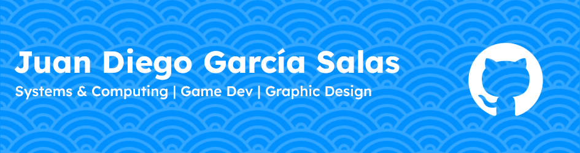

<h6 align="left">profile(TheHoodini){</h6>

###

  

###

<h4 align="center">Systems & Computing Engineering student at Universidad del Norte. Game Design enthusiast</h3>

###

<h2 align="center">I code with</h2>

###

  
  
  
  
  
  
  

###

<h3 align="center">And also work with</h3>

###

  
  
  
  
  
  
  

###

###

<h6 align="right">}</h6>
<h6 align="left">//Hello World!</h6>

###
